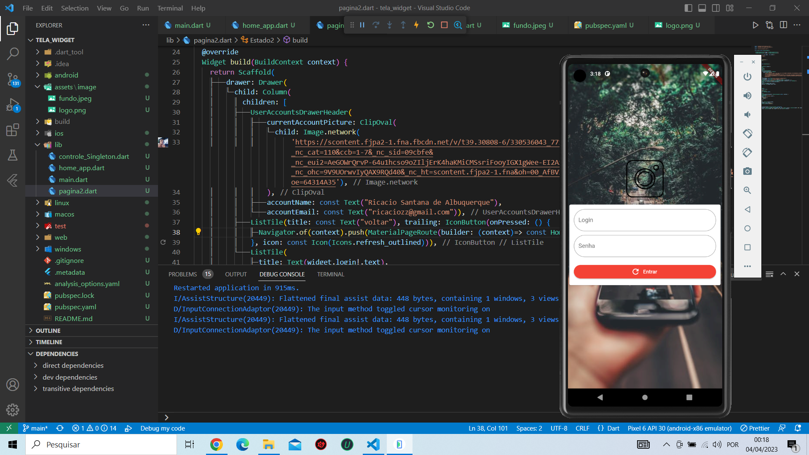

# praticando Markdown
**Markdown** é uma linguagem de marcação simples que voce pode usar para adicionar facilmente formatação a *textos*  na web.

## E-commerce empresa X

vamos criar um **e-commerce** para empresa x

### funcionalidades 
_checkout,**tela de produto** catálogo home com banner_

**checkout,_tela de produto_ catálogo home com banner**

###### Melhorias

__Melhorias1__ ,_Melhorias2_ **t** *t*

### Linguagem do projeto 

* HTML
* CSS
* JavaScript
* PHP
* MySQL

### Funcionalidades a desenvolver:

1. Área de membros
    1. a
    2. b
    3. c
2. Integração com outros pagamentos
3. Sistema de bônus primeira compra

#### Imagem Local

#### Imagem da Web

##### Links em Markdown

[Google](https://www.google.com/search?q=google&oq=google&gs_lcrp=EgZjaHJvbWUyBggAEEUYOTIGCAEQRRg7MgYIAhBFGDsyBggDEEUYPDIGCAQQRRg8MgYIBRBFGDwyBggGEEUYQTIGCAcQRRhB0gEJODkzNGowajE1qAIAsAIA&sourceid=chrome&ie=UTF-8)

